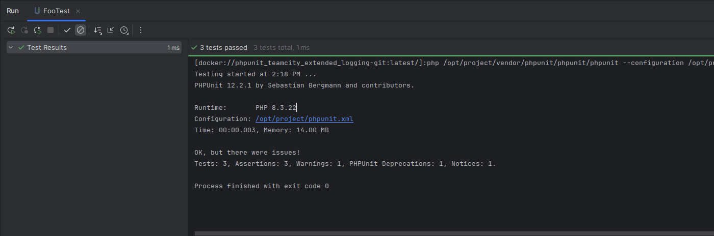
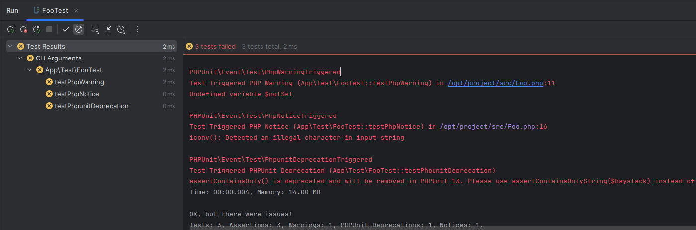

# Issue logging for PHPUnit tests in PhpStorm

This is a PHPUnit extension for reporting test issues in PhpStorm.

With current PHPUnit versions, only critical failures that change the outcome of
a test are visible in the PhpStorm testing UI and cause the test to be
considered failed. This extension modifies PHPUnit's logging mechanism so that
non-critical issues (warnings / notices / deprecations) are also reported and
cause a test failure.

Related PHPUnit issue: [#4711][phpunit-issue-4711]. This extension may be
considered a workaround for this issue.

[phpunit-issue-4711]: https://github.com/sebastianbergmann/phpunit/issues/4711

## Example

Before setting up the extension:

After:

## Limitations

1. Works with PHPUnit versions 10.0 and newer.

2. Does not handle issues triggered by data providers. See explanation below.

3. Does not handle issues triggered by mocking / stubbing failures. In recent
   PHPUnit versions, these are reported as errors, not warnings, and therefore
   should already be visible in PhpStorm.

4. No support for logging to files, only to stdout. This is sufficient for usage
   with PhpStorm, other TeamCity usage scenarios are out of scope. For more
   context on this, see the technical considerations section below.

5. No support for the `flowId` attribute. This should be sufficient for usage
   with PhpStorm, however it may cause some errors if the tests are run in
   parallel, e.g. with ParaTest. I'm hesitant to add support for this, because
   it would require copying functionality from the `TeamCityLogger` component.
   See the technical considerations section.

## Setup

1. Run:

        composer require --dev pawel-slowik/phpunit-phpstorm-issue-logging

2. Register the extension. Usually it's enough to add it to `phpunit.xml`:

        <phpunit ...>
             <!-- your content here... -->
             <extensions>
                 <bootstrap class="PawelSlowik\PhpunitPhpstormIssueLogging\PhpstormIssueLoggingExtension">
                     <parameter name="followExitCodeLogic" value="true"/>
                 </bootstrap>
             </extensions>
        </phpunit>

   For details, see [Registering an extension][registering-an-extension].

3. Configure the extension. There are 3 options available:

   - Default configuration, without any parameters, will report *all* issues:

             <phpunit>
                  <extensions>
                      <bootstrap class="PawelSlowik\PhpunitPhpstormIssueLogging\PhpstormIssueLoggingExtension"/>
                  </extensions>
             </phpunit>

   - Limit reporting to issues which cause PHPUnit to exit with an error code.
     For example, if your PHPUnit configuration contains `failOnWarning="true"`,
     warnings will be reported in PhpStorm, but not notices or deprecations.
     With this setting, all the issues that cause a failure in your CI setup
     should also be visible in PhpStorm's UI.

             <phpunit>
                  <extensions>
                      <bootstrap class="PawelSlowik\PhpunitPhpstormIssueLogging\PhpstormIssueLoggingExtension">
                          <parameter name="followExitCodeLogic" value="true"/>
                      </bootstrap>
                  </extensions>
             </phpunit>

   - Manually select issue types to report with a comma separated list:

             <phpunit>
                  <extensions>
                      <bootstrap class="PawelSlowik\PhpunitPhpstormIssueLogging\PhpstormIssueLoggingExtension">
                          <parameter name="issueTypes" value="warning, php_warning"/>
                      </bootstrap>
                  </extensions>
             </phpunit>

     See below for a list of supported types.

4. Make sure warnings / notices / deprecations aren't suppressed by PHPUnit's
   configuration. The following options should be **disabled**:

   - `ignoreSelfDeprecations`
   - `restrictNotices`
   - `restrictWarnings`

   They are disabled by default, so they should either be absent from PHPUnit's
   configuration file or explicitly set to `false`.

   - Note that some PHPUnit versions will set `restrictNotices` and
     `restrictWarnings` to `true` when generating a configuration with the
     `--generate-configuration` command, so you may want to check this even if
     you've never set any of these before.

   For details, see [The `source` element][the-source-element].

5. Run your tests from PhpStorm's UI as usual.

[registering-an-extension]: https://docs.phpunit.de/en/12.2/extending-phpunit.html#registering-an-extension
[the-source-element]: https://docs.phpunit.de/en/12.2/configuration.html#the-source-element

## Issue types

Issue types are based on [PHPUnit's test events][phpunit-test-events], e.g. a
`phpunit_deprecation` issue corresponds to a
`PHPUnit\Event\Test\PhpunitDeprecationTriggered` event. When specified in the
configuration with the `issueTypes` parameter, they are case insensitive and can
be spelled with or without an underscore, e.g. `phpunit_warning` is the same as
`PHPUnitWarning`.

Supported types are:

- `warning`
- `php_warning`
- `phpunit_warning`
- `notice`
- `php_notice`
- `phpunit_notice`
- `deprecation`
- `php_deprecation`
- `phpunit_deprecation`

Note that each of the above types is a separate, discrete category, e.g. a
`warning` does *not* imply a `php_warning` or the other way around.

[phpunit-test-events]: https://docs.phpunit.de/en/12.2/events.html#test

## Data provider issues

Failures caused by data providers can't be handled safely without major
restructuring of PHPUnit's TeamCity logging subsystem. The reasons are as
follows:

1. The TeamCity logger relies on a `TestSuiteStarted` event to send protocol
   headers. The data providers, however, are evaluated prior to starting the
   testsuite, before this event is triggered. Therefore, handling data provider
   errors at this point would send their error messages in advance of the
   headers. This is a protocol error.

2. The number of tests to be executed is included in TeamCity protocol headers.
   While calculating this number, PHPUnit skips test methods with data provider
   errors. Including them the log would cause a discrepancy between the number
   of tests advertised in the headers and the actual number of messages sent.

Data provider errors are signaled with a
`PHPUnit\Event\Test\PhpunitErrorTriggered` event and currently this is the only
use for this event. Because of the problems described above, the event has been
skipped when implementing the extension.

## Technical considerations

It would be better to send the messages with the `TeamCityLogger` component
instead of printing them on stdout. Unfortunately this component is internal to
PHPUnit, therefore neither does it guarantee API stability, nor is it exposed
through any of PHPUnit's facades intended for extension developers.
It is possible to make use of it by abusing reflection, but if you're willing to
resort to hacks like these, you'd be better off maintaining a copy of the
extension as a part of your application.

## Testing / development

Run dockerized tests for multiple PHP and PHPUnit versions:

    find tests -name Dockerfile -print0 | xargs -0 -n 1 docker build -q . -f | xargs -n 1 docker run --rm

Note: this is *not* required if you just want to use the extension. These
commands are useful for working on the extension, not on your app.
